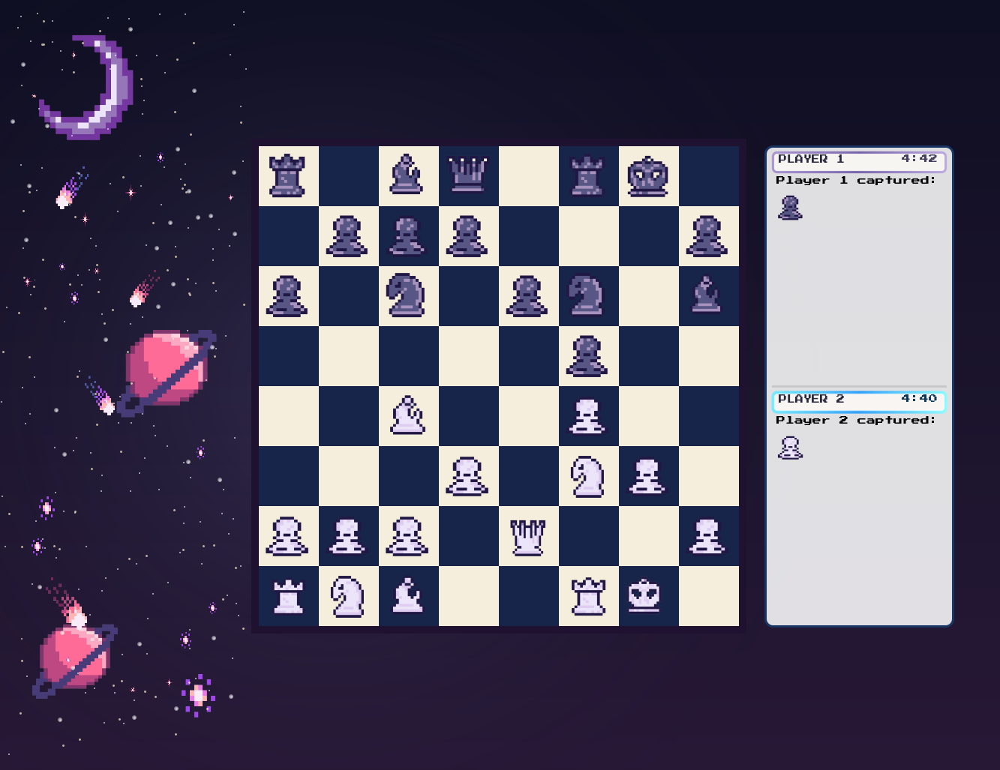

# Java-Chess ♔♛♜♝♞♟

**Progetto per il corso di Programmazione a Oggetti**

Un'implementazione completa del gioco degli scacchi in Java con interfaccia grafica, progettata per dimostrare l'applicazione dei principi fondamentali della programmazione orientata agli oggetti.

## 🎯 Panoramica del Progetto

Questo progetto implementa un gioco di scacchi completamente funzionale con:
- Interfaccia grafica intuitiva sviluppata con Java Swing
- Logica di gioco completa con tutte le regole degli scacchi
- Supporto per mosse speciali (arrocco, en passant, promozione pedone)
- Rilevamento di scacco, scacco matto e situazioni di pareggio
- Sistema di cattura dei pezzi
- Interfaccia utente con tema spaziale



## 🏗️ Architettura e Principi OOP

### 1. **Incapsulamento (Encapsulation)**

Il progetto dimostra l'incapsulamento attraverso:

- **Classe `Piece`**: Incapsula le proprietà comuni di tutti i pezzi (posizione, colore, texture, stato di movimento)
- **Classe `Board`**: Nasconde la complessità della gestione dei pezzi, esponendo solo metodi necessari
- **Classe `GameLogic`**: Incapsula tutta la logica del gioco, mantenendo privati i dettagli implementativi

```java
public abstract class Piece {
    protected BufferedImage texture;
    protected String name;
    protected boolean hasMoved;
    protected ChessColor color;
    protected Position position;
    // Metodi pubblici per accesso controllato
}
```

### 2. **Ereditarietà (Inheritance)**

L'ereditarietà è implementata attraverso:

- **Classe base astratta `Piece`**: Definisce il comportamento comune
- **Classi derivate**: `King`, `Queen`, `Rook`, `Bishop`, `Knight`, `Pawn`
- Ogni pezzo eredita proprietà comuni e implementa il proprio comportamento specifico

### 3. **Polimorfismo (Polymorphism)**

Il polimorfismo è evidenziato da:

- **Metodo astratto `getValidPositions()`**: Ogni pezzo implementa la propria logica di movimento
- **Metodo `copy()`**: Implementazione specifica per ogni tipo di pezzo
- **Gestione uniforme**: Tutti i pezzi possono essere trattati come oggetti `Piece`

```java
// Esempio di polimorfismo - ogni pezzo ha la sua implementazione
public abstract List<Position> getValidPositions();
public abstract Piece copy();
```

### 4. **Astrazione (Abstraction)**

L'astrazione è realizzata mediante:

- **Classe astratta `Piece`**: Definisce l'interfaccia comune senza implementazione specifica
- **Enum `ChessColor`**: Astratta il concetto di colore del giocatore
- **Classe `Position`**: Astratta le coordinate sulla scacchiera
- **Separazione delle responsabilità**: GUI, logica di gioco e rappresentazione dei dati sono separate

## 🎨 Struttura del Progetto

```
src/main/java/
├── Main.java                 # Punto di ingresso dell'applicazione
├── GameGUI.java             # Interfaccia grafica utente
├── GameLogic.java           # Logica di gioco e regole
├── Board.java               # Gestione della scacchiera
├── Piece.java               # Classe base astratta per i pezzi
├── Position.java            # Rappresentazione delle coordinate
├── ChessColor.java          # Enum per i colori dei giocatori
└── Pieces/
    ├── King.java            # Implementazione del Re
    ├── Queen.java           # Implementazione della Regina
    ├── Rook.java            # Implementazione della Torre
    ├── Bishop.java          # Implementazione dell'Alfiere
    ├── Knight.java          # Implementazione del Cavallo
    └── Pawn.java            # Implementazione del Pedone
```

## 🎮 Funzionalità Implementate

### Regole Base
- ✅ Movimento valido per tutti i pezzi
- ✅ Turni alternati tra giocatori
- ✅ Cattura dei pezzi avversari
- ✅ Rilevamento di scacco e scacco matto

### Regole Speciali
- ✅ **Arrocco**: Corto e lungo per entrambi i giocatori
- ✅ **En Passant**: Cattura speciale del pedone
- ✅ **Promozione**: Trasformazione del pedone raggiunta l'ottava traversa
- ✅ **Situazioni di pareggio**: Stallo, regola dei 50 movimenti

### Interfaccia Utente
- ✅ Interfaccia grafica con tema spaziale
- ✅ Drag & drop per muovere i pezzi
- ✅ Evidenziazione delle mosse valide
- ✅ Indicatore del turno corrente
- ✅ Visualizzazione pezzi catturati

## 🚀 Come Eseguire il Progetto

### Prerequisiti
- Java 11 o versioni successive
- IDE compatibile con Java (IntelliJ IDEA, Eclipse, VS Code)

### Istruzioni
1. Clona il repository
2. Compila il progetto
3. Esegui la classe `Main.java`
4. Inizia a giocare!

## 🎨 Interfaccia Grafica

L'interfaccia utilizza un tema spaziale con:
- Sfondo stellato animato
- Pezzi con texture personalizzate
- Effetti visivi per le mosse
- Layout responsive

*Sviluppato per il corso di Programmazione a Oggetti - Università degli Studi di Modena e Reggio Emilia*
